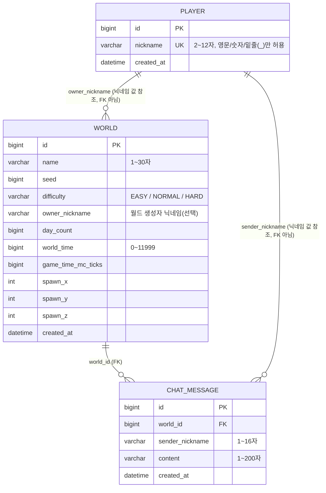

# WebCraft 실시간 게임 서버 구현

Spring Boot 기반으로 만든 실시간 멀티플레이 게임 서버 과제입니다. 플레이어 등록, 월드 생성·관리, WebSocket 기반 실시간 이동/채팅/접속자 조회를 REST API와 WebSocket API로 제공합니다. 게임 로직(지형 생성, 몹/물리 시뮬레이션 등)은 `webcraft-engine` 의존성이 제공하고, 이 저장소는 그 위에서 동작하는 플레이어·월드·채팅 도메인과 WebSocket 연동 계층을 구현합니다.

## 기술 스택

- Java 21, Spring Boot 4.1.0
- Spring Data JPA (MySQL 8.0)
- Spring Data Redis (Redis 7)
- Spring WebSocket
- Bean Validation (Jakarta Validation)
- Docker Compose (로컬 MySQL·Redis)
- Gradle

## 실행 방법

```bash
# 1) MySQL·Redis 컨테이너 기동
docker compose up -d

# 2) 애플리케이션 실행
./gradlew bootRun
```

`src/main/resources/application.properties`에 데이터소스·Redis 접속 정보가 설정되어 있고, `spring.jpa.hibernate.ddl-auto=update`로 엔티티에 선언된 스키마(테이블·인덱스)가 기동 시 자동 반영됩니다.

## ERD



`CHAT_MESSAGE.world_id`는 `WORLD.id`를 참조하는 실제 외래키(`@ManyToOne`)입니다. 반면 `WORLD.owner_nickname`과 `CHAT_MESSAGE.sender_nickname`은 `PLAYER.nickname` 값을 그대로 복사해 저장하는 비정규화 컬럼으로, DB 제약조건으로 강제되는 외래키는 아닙니다(조회 시 매번 플레이어 테이블을 조인하지 않기 위한 설계입니다).

`chat_messages` 테이블에는 `(world_id, created_at)` 복합 인덱스가 걸려 있어, "특정 월드의 최근 채팅 N건 조회" 쿼리가 인덱스만으로 정렬·범위 조회를 수행할 수 있습니다.

## API 명세

### REST API

| Method | Path | 설명 | 요청 | 성공 응답 |
|---|---|---|---|---|
| POST | `/players` | 플레이어(닉네임) 등록 | `{"nickname": string}` (2~12자, 영문 대소문자/숫자/`_`) | `201 Created` (본문 없음) |
| POST | `/worlds` | 월드 생성 | `{"name": string(1~30자), "difficulty": "EASY"|"NORMAL"|"HARD"(선택), "nickname": string(선택, 2~12자), "debugSeed": long(선택)}` | `201 Created` + `{"id","name","seed","difficulty","ownerNickname"}` |
| GET | `/worlds` | 월드 목록 조회 | - | `200 OK` + `[{"id","name","seed","onlineCount","difficulty"}, ...]` |
| DELETE | `/worlds/{id}` | 월드 삭제 | 쿼리 파라미터 `nickname`(선택, 소유자 검증용) | `204 No Content` |
| DELETE | `/worlds/{id}/if-matches` | 조건부 월드 삭제 (낙관적 락, `도전` Lv16용 스캐폴딩) | `{"name","seed","difficulty","ownerNickname"}` — 현재 상태와 일치할 때만 삭제 | `204 No Content` |
| GET | `/worlds/{worldId}/chats` | 월드의 최근 채팅 내역 조회 | 쿼리 파라미터 `limit`(선택, 기본값 50) | `200 OK` + `[{"sender","content","createdAt"}, ...]` (오래된 순 → 최신 순) |

**공통 에러 응답**: `{"error": "<코드>"}` 형식이며, 발생한 예외 종류에 따라 HTTP 상태가 결정됩니다.

| 코드 예시 | HTTP 상태 | 상황 |
|---|---|---|
| `VALIDATION_FAILED` | 400 | 요청 본문의 Bean Validation 실패 |
| `DUPLICATE_NICKNAME` | 409 | 이미 등록된 닉네임으로 플레이어 생성 시도 |
| `WORLD_LIMIT_REACHED` | 409 | 최대 월드 개수 초과 |
| `WORLD_BASELINE_INITIALIZING` | 503 | 엔진의 월드 베이스라인 초기화가 끝나기 전 요청 |
| `NOT_FOUND` / `FORBIDDEN` 등 | 404 / 403 | 대상 없음 / 권한 없음 |

### WebSocket API

**연결**
```
ws://{host}:{port}/ws/worlds/{worldId}?nickname={nickname}
```
`nickname`은 `POST /players`로 미리 등록되어 있어야 하며, `worldId`는 실제 존재하는 월드여야 합니다. 핸드셰이크 단계에서 검증에 실패하면 다음 코드로 연결이 즉시 종료됩니다.

| 종료 코드 | 의미 |
|---|---|
| `4000` | 닉네임 누락 또는 등록되지 않은 닉네임 |
| `4001` | 존재하지 않는 월드 |
| `4002` | 이미 같은 월드에 같은 닉네임으로 연결된 세션이 있음(중복 접속 거부) |

모든 메시지는 `type` 필드로 종류를 구분하는 JSON 텍스트 프레임입니다.

**클라이언트 → 서버**

| type | 필드 | 설명 |
|---|---|---|
| `move` | `x,y,z`(double), `yaw,pitch`(float), `crouching,gliding`(boolean) | 이동 요청. 서버가 엔진 액션 큐에 적재해 다음 틱에 반영 |
| `chat` | `content`(string, 1~200자) | 채팅 전송. DB에 저장 후 같은 월드 전원에게 브로드캐스트 |
| `ping` | - | 접속 유지용 하트비트(권장 주기 15초). 서버는 Redis에 등록된 접속 상태의 만료 시각을 갱신 |
| `onlineUsers` | - | 현재 월드의 접속자 목록 요청 |

**서버 → 클라이언트**

| type | 필드 | 전송 대상 |
|---|---|---|
| `chat` | `sender, content, timestamp` | 같은 월드에 접속한 전원(보낸 사람 포함) |
| `pong` | - | 요청을 보낸 세션 |
| `onlineUsers` | `users`(string 배열, 닉네임 오름차순 정렬), `count`(int) | 요청을 보낸 세션만 |
| `error` | `code` | 요청을 보낸 세션만 |

WS 에러 코드: `INVALID_JSON`, `INVALID_MESSAGE`, `UNKNOWN_TYPE`, `QUEUE_FULL`, `INTERNAL_ERROR`, `CHAT_COOLDOWN`(초당 채팅 횟수 제한 초과)

## 구현 범위

`필수` 항목(Lv1~15)을 모두 구현했습니다 — Docker 인프라 구성, JPA 인덱스, 플레이어·월드 등록, 채팅 저장·조회, WebSocket 연결·이동·채팅·접속자 목록까지 이어지는 실시간 게임 서버의 핵심 흐름입니다. `도전` 항목(Lv16~20: 낙관적 락, 커서 기반 페이지 조회, Redis 채팅 캐시, Redis Lua 기반 전송 횟수 제한, 멀티 서버 확장)은 선택 과제로 별도 진행합니다.
